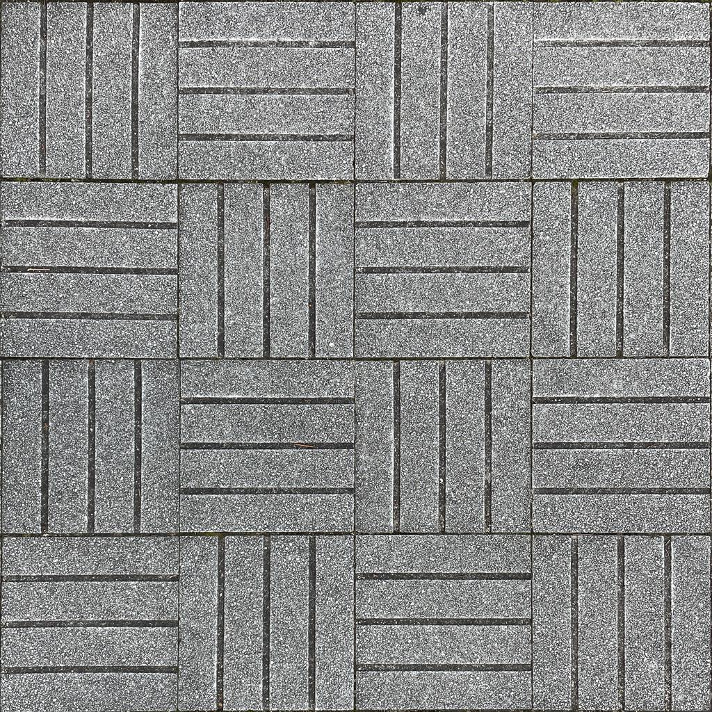
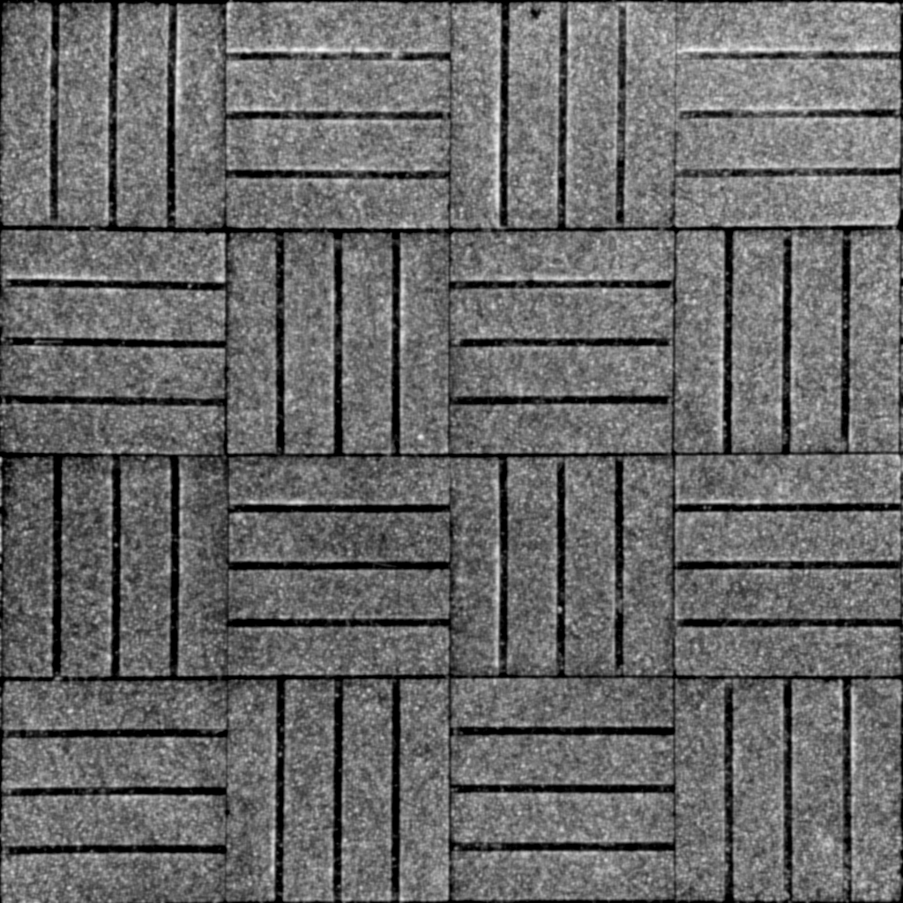

# 画像の出典

## ashimoto.png

和歌山大学システム工学部の床井浩平准教授が公開されている ＣＧ制作演習資料（2021 年度）(http://web.wakayama-u.ac.jp/~tokoi/cgpe2021.html)※1 の「第３回 シェーダ、ライティング、レンダリング 画像でバンプマッピング」でPDFに掲載の画像を切り抜いたもの

※1 CC-BYライセンスで公開されています

## ashimoto_gray.png

ashimoto.pngを階調強調やぼかし処理をした後に、グレースケールに変換したもの

